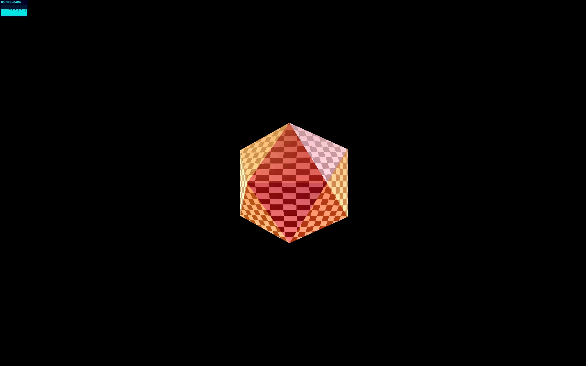

# three-ts-starter

A three.js starter repo

Features:

- Builds using webpack
- Uses [glslify](https://github.com/glslify/glslify)
  - [src/object3d/Sphere.ts](https://github.com/mikkoh/three-ts-starter/blob/master/src/object3d/Sphere.ts#L16-L33) creates a custom material with shaders that extend [Three.js Shader Lib Shaders](https://github.com/mrdoob/three.js/tree/dev/src/renderers/shaders/ShaderLib)

## References

- [amsXYZ three-ts-template (original fork)](https://github.com/amsXYZ/three-ts-template)

## License

The code is available under the [MIT license](LICENSE)
